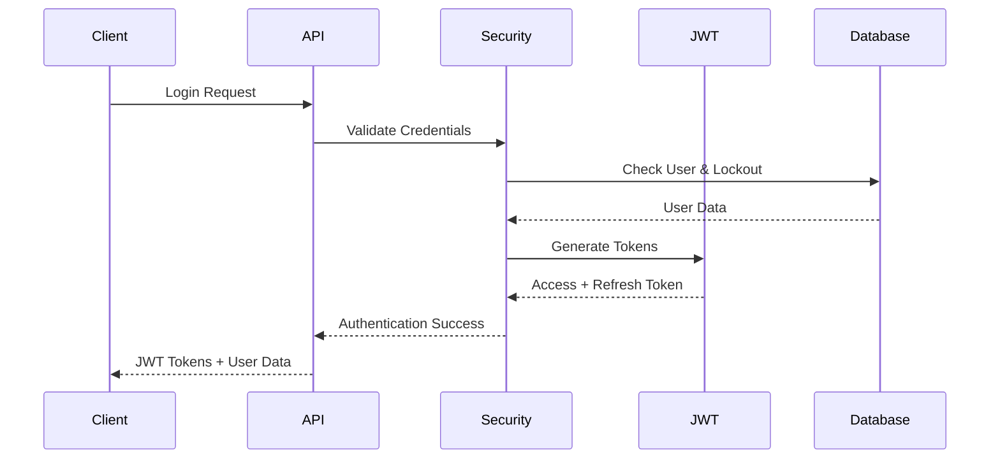

# 🏢 Enterprise Authentication & Authorization System

<div align="center">


**A production-ready Spring Boot enterprise platform featuring advanced authentication, comprehensive security management, and extensive activity tracking**

[🚀 Quick Start](#-quick-start) • [📖 Features](#-key-features) • [🏗️ Architecture](#-project-architecture) • [🛡️ Security](#-security-system) • [📚 API Docs](#-api-documentation) • [🚀 Deployment](#-deployment)

</div>

---

## 📋 Table of Contents

- [🎯 Project Overview](#-project-overview)
- [✨ Key Features](#-key-features)
- [🛠️ Technology Stack](#-technology-stack)
- [🚀 Quick Start](#-quick-start)
- [🏗️ Project Architecture](#-project-architecture)
- [🛡️ Security System](#-security-system)
- [📚 API Documentation](#-api-documentation)
- [⚙️ Configuration](#-configuration)
- [👨‍💻 Development Guide](#-development-guide)
- [🚀 Deployment](#-deployment)
- [🤝 Contributing](#-contributing)
- [📄 License](#-license)

---

## 🎯 Project Overview

This is a **comprehensive enterprise-grade authentication and authorization platform** built with Spring Boot 3.5.0, designed to provide a robust foundation for modern business applications. The system offers advanced security features, detailed audit trails, and flexible role-based access control suitable for enterprise environments.

### 🏆 Why Choose This Platform?

- **🔐 Enterprise Security**: Multi-layer security with JWT, OAuth2, brute force protection, and token versioning
- **📊 Complete Audit Trail**: Comprehensive logging of user activities and administrative actions
- **🎯 Flexible RBAC**: Dynamic role-based access control with fine-grained permissions
- **🚀 Production Ready**: Docker deployment, environment management, and scalability considerations
- **📱 Modern Architecture**: Clean architecture patterns with AOP and standardized API responses
- **🔧 Developer Friendly**: Comprehensive documentation, automated testing, and hot reload support

---

## ✨ Key Features

### 🔐 **Advanced Authentication & Authorization**
- **Multi-Provider Authentication**: Traditional login, Google OAuth2, Facebook OAuth2
- **JWT Token Management**: Access tokens with automatic refresh token rotation
- **Token Versioning System**: Global and user-specific token invalidation capabilities
- **Account Security**: Brute force protection with progressive lockout mechanisms
- **Session Management**: Multi-device session tracking and forced logout capabilities

### 🛡️ **Enterprise Security Framework**
- **@SecuredEndpoint Annotation**: Declarative security for methods and classes
- **Dynamic Permission System**: Runtime permission checking with JWT token validation
- **Security Event Logging**: Complete audit trail for all security-related events
- **Account Lockout Management**: Automatic and manual account lockout with admin override
- **IP-based Monitoring**: Track and analyze access patterns by IP address

### 📊 **Comprehensive Logging & Audit**
- **User Activity Tracking**: Detailed logs for all user actions with context
- **Administrative Action Logging**: Complete audit trail for admin operations
- **Change Tracking**: Before/after values for all data modifications
- **Export Capabilities**: Export logs in multiple formats for compliance
- **Real-time Monitoring**: Live activity feeds and security event notifications

### 🏗️ **Modern Architecture & Patterns**
- **Clean Architecture**: Clear separation of concerns across layers
- **Aspect-Oriented Programming**: Cross-cutting concerns handled elegantly
- **Standardized Responses**: Consistent `ResponseObject` format across all APIs
- **Global Exception Handling**: Unified error handling with proper HTTP status codes
- **Bean Validation**: Comprehensive input validation with custom validators

### 🔧 **Developer Experience**
- **Hot Reload Development**: Fast iteration cycles during development
- **Swagger Integration**: Auto-generated API documentation with security requirements
- **Docker Compose Setup**: One-command development environment
- **Comprehensive Testing**: Unit, integration, and security test coverage
- **Data Initialization**: Automated setup with sample data and default roles

---

## 🛠️ Technology Stack

### **Core Framework**
| Technology | Version | Purpose |
|------------|---------|---------|
| **Spring Boot** | 3.5.0 | Main application framework |
| **Spring Security** | 6.x | Authentication & authorization |
| **Spring Data JPA** | 3.x | Data persistence layer |
| **Spring AOP** | 3.x | Aspect-oriented programming |

### **Database & Persistence**
| Technology | Version | Purpose |
|------------|---------|---------|
| **MySQL** | 8.0+ | Primary database |
| **Hibernate** | 6.x | ORM with optimized queries |
| **HikariCP** | 5.x | High-performance connection pooling |

### **Security & Authentication**
| Technology | Version | Purpose |
|------------|---------|---------|
| **JWT** | Latest | Stateless authentication |
| **OAuth2** | 2.0 | Third-party authentication |
| **BCrypt** | Latest | Password hashing |

### **Documentation & Testing**
| Technology | Version | Purpose |
|------------|---------|---------|
| **Swagger/OpenAPI** | 3.x | API documentation |
| **JUnit** | 5.x | Unit testing framework |
| **Spring Boot Test** | 3.x | Integration testing |

### **Build & Deployment**
| Technology | Version | Purpose |
|------------|---------|---------|
| **Maven** | 3.9+ | Build automation |
| **Docker** | Latest | Containerization |
| **Docker Compose** | Latest | Multi-container deployment |

---

## 🚀 Quick Start

### Prerequisites
- ☕ **Java 17+** (OpenJDK or Oracle JDK)
- 🛠️ **Maven 3.9+** for build automation
- 🐳 **Docker & Docker Compose** (recommended for easy setup)
- 🗄️ **MySQL 8.0+** (or use Docker setup)

### 🐳 Option 1: Docker Compose (Recommended)

```bash
# Clone the repository
git clone https://github.com/caovanducanh/demo_login.git
cd demo_login

# Start the entire stack (app + database)
docker-compose up --build

# Access the application
# API Base: http://localhost:8080
# Swagger UI: http://localhost:8080/swagger-ui/index.html
# Database: localhost:3306 (user: demo, password: demo123)
```

### 🔧 Option 2: Local Development

```bash
# Clone the repository
git clone https://github.com/caovanducanh/demo_login.git
cd demo_login

# Create environment configuration
cp .env.example .env
# Edit .env with your database credentials and OAuth2 settings

# Start MySQL database (if not using Docker)
# Create database: demo_login

# Run the application
./mvnw spring-boot:run

# Or build and run JAR
./mvnw clean package
java -jar target/demo-login-*.jar
```

### 🎯 First Steps After Setup

1. **Access Swagger UI**: http://localhost:8080/swagger-ui/index.html
2. **Default Admin Account**:
   - **Username**: `admin`
   - **Password**: `admin123`
3. **Test Authentication**: Use the `/api/login` endpoint to get JWT token
4. **Explore APIs**: All endpoints are documented with examples in Swagger

---

## 🏗️ Project Architecture

### 📁 Project Structure

```
src/main/java/com/example/demologin/
├── 🎮 controller/              # REST API Controllers
│   ├── AuthenticationController.java      # Login, register, OAuth2
│   ├── UserActionLogController.java       # Activity log management
│   ├── SessionManagementController.java   # Session control
│   ├── TokenVersionController.java        # Token invalidation
│   ├── RoleController.java               # Role management
│   ├── PermissionController.java         # Permission management
│   └── EmailOtpController.java           # Email verification
├── 📦 dto/                     # Data Transfer Objects
│   ├── request/               # API request DTOs with validation
│   │   ├── user/             # User-related requests
│   │   ├── role/             # Role management requests
│   │   ├── login/            # Authentication requests
│   │   ├── emailOTP/         # Email verification requests
│   │   └── userActionLog/    # Activity log requests
│   └── response/             # API response DTOs
│       ├── ResponseObject.java        # Standardized response wrapper
│       ├── UserResponse.java          # User data response
│       ├── LoginResponse.java         # Authentication response
│       └── PageResponse.java          # Paginated response
├── 🗃️ entity/                 # JPA Entity Models
│   ├── User.java             # User entity with UserDetails
│   ├── Role.java             # Role entity
│   ├── Permission.java       # Permission entity
│   ├── UserActionLog.java    # User action audit logs
│   ├── UserActivityLog.java  # User activity logs
│   ├── AccountLockout.java   # Account lockout tracking
│   ├── RefreshToken.java     # Refresh token management
│   └── EmailOtp.java         # Email OTP verification
├── 🔧 service/                # Business Logic Interfaces
│   ├── AuthenticationService.java
│   ├── SecurityManagementService.java
│   ├── UserActionLogService.java
│   ├── RoleService.java
│   └── EmailOtpService.java
├── 🔧 serviceImpl/            # Business Logic Implementations
│   ├── AuthenticationServiceImpl.java
│   ├── SecurityManagementServiceImpl.java
│   ├── UserActionLogServiceImpl.java
│   ├── RoleServiceImpl.java
│   └── EmailOtpServiceImpl.java
├── 📊 repository/             # Data Access Layer
│   ├── UserRepository.java
│   ├── RoleRepository.java
│   ├── PermissionRepository.java
│   ├── UserActionLogRepository.java
│   └── AccountLockoutRepository.java
├── 🛡️ aspect/                # Cross-Cutting Concerns
│   ├── SecuredEndpointAspect.java     # Security validation
│   ├── UserActionLogAspect.java      # User action logging
│   └── UserActivityAspect.java       # User activity tracking
├── 📝 annotation/             # Custom Annotations
│   ├── @SecuredEndpoint       # Declarative security
│   ├── @UserAction            # Action logging
│   └── @UserActivity          # Activity tracking
├── ⚙️ config/                # Configuration Classes
│   ├── SecurityConfig.java           # Spring Security configuration
│   ├── CORSConfig.java              # Cross-origin configuration
│   ├── CustomOAuth2SuccessHandler.java
│   ├── CustomOAuth2FailureHandler.java
│   └── DotenvLoader.java            # Environment variable loading
├── 🚨 exception/             # Exception Handling
│   ├── GlobalExceptionHandler.java   # Centralized error handling
│   └── exceptions/           # Custom exception classes
│       ├── NotFoundException.java
│       ├── ValidationException.java
│       ├── ConflictException.java
│       ├── BadRequestException.java
│       ├── UnauthorizedException.java
│       ├── ForbiddenException.java
│       ├── AccountLockedException.java
│       └── TokenValidationException.java
├── 🗺️ mapper/                # Entity-DTO Mapping
│   ├── UserMapper.java
│   ├── RoleMapper.java
│   └── PermissionMapper.java
├── 🔧 utils/                 # Utility Classes
│   ├── JwtUtil.java          # JWT token operations
│   ├── AccountUtils.java     # Account utility functions
│   └── PageUtils.java        # Pagination utilities
├── 🏗️ initializer/           # Data Initialization
│   └── DataInitializer.java  # Default data setup
└── 🔍 enums/                 # Enumeration Classes
    ├── UserStatus.java       # ACTIVE, DISABLED
    ├── UserActionType.java   # CREATE, UPDATE, DELETE, etc.
    ├── ActivityType.java     # LOGIN, LOGOUT, etc.
    └── Gender.java           # MALE, FEMALE, OTHER
```

### 🎨 Architectural Patterns

#### **1. Clean Architecture Layers**
```
┌─────────────────────────────────────┐
│           🎮 Controller Layer        │  ← HTTP requests/responses
├─────────────────────────────────────┤
│           🔧 Service Layer           │  ← Business logic
├─────────────────────────────────────┤
│          📊 Repository Layer         │  ← Data access
├─────────────────────────────────────┤
│           🗃️ Entity Layer            │  ← Domain models
└─────────────────────────────────────┘
```

#### **2. Aspect-Oriented Programming (AOP)**
- **🛡️ Security Aspects**: `@SecuredEndpoint` for permission validation
- **📝 Logging Aspects**: `@UserAction` and `@UserActivity` for audit trails
- **🔍 Cross-cutting Concerns**: Centralized handling of common functionality

#### **3. Dependency Injection Pattern**
- **Constructor Injection**: Using `@RequiredArgsConstructor` from Lombok
- **Interface Segregation**: Clear separation between service interfaces and implementations
- **Inversion of Control**: Spring IoC container manages all dependencies

---

## 🛡️ Security System

### 🔐 Authentication Flow

The system supports multiple authentication methods with comprehensive security measures:



### 🛡️ Authorization System

#### **@SecuredEndpoint Annotation**
The system uses a declarative security approach with custom annotations:

```java
// Method-level security
@GetMapping("/admin/users")
@SecuredEndpoint("USER_MANAGEMENT")
public ResponseEntity<ResponseObject> getUsers() {
    // Only users with USER_MANAGEMENT permission can access
}

// Class-level security (applies to all methods)
@RestController
@SecuredEndpoint("ADMIN_ACCESS")
public class AdminController {
    // All methods require ADMIN_ACCESS permission
}
```

#### **Permission Hierarchy**
The system implements a flexible permission hierarchy:

```
🏢 ENTERPRISE PERMISSIONS
├── 👥 USER_MANAGEMENT
│   ├── USER_CREATE               # Create new users
│   ├── USER_UPDATE               # Update user information
│   ├── USER_DELETE               # Delete users
│   └── USER_VIEW                 # View user details
├── 🔐 SECURITY_MANAGEMENT
│   ├── ADMIN_SECURITY_MANAGEMENT # Security operations
│   ├── ADMIN_USER_MANAGEMENT     # User account management
│   ├── ACCOUNT_LOCK              # Lock user accounts
│   └── ACCOUNT_UNLOCK            # Unlock user accounts
├── 🎭 ROLE_MANAGEMENT
│   ├── ROLE_CREATE               # Create new roles
│   ├── ROLE_UPDATE               # Update role information
│   ├── ROLE_DELETE               # Delete roles
│   ├── ROLE_VIEW                 # View roles
│   └── ROLE_UPDATE_PERMISSIONS   # Assign permissions to roles
├── 🔑 PERMISSION_MANAGEMENT
│   ├── PERMISSION_VIEW           # View permissions
│   └── PERMISSION_UPDATE         # Update permission details
├── 🎫 TOKEN_MANAGEMENT
│   ├── TOKEN_INVALIDATE_OWN      # Invalidate own tokens
│   ├── TOKEN_INVALIDATE_USER     # Admin invalidate user tokens
│   ├── TOKEN_VIEW_OWN            # View own token info
│   ├── TOKEN_VIEW_USER           # View user token info
│   ├── TOKEN_VALIDATE            # Validate tokens
│   └── USER_TOKEN_MANAGEMENT     # General token operations
├── 📊 LOG_MANAGEMENT
│   ├── LOG_VIEW_ALL              # View all activity logs
│   ├── LOG_VIEW_OWN              # View own activity logs
│   ├── LOG_SEARCH                # Search activity logs
│   └── LOG_EXPORT                # Export activity logs
└── 📋 SYSTEM_MANAGEMENT
    ├── SYSTEM_CONFIG             # System configuration
    └── SYSTEM_MONITOR            # System monitoring
```

### 🔒 JWT Token Management

#### **Token Structure**
```json
{
  "sub": "username",
  "userId": 123,
  "permissionCodes": [
    "USER_MANAGEMENT", 
    "ROLE_VIEW", 
    "LOG_VIEW_ALL"
  ],
  "tokenVersion": 1,
  "iat": 1703980800,
  "exp": 1703984400
}
```

#### **Token Security Features**
- **🔄 Token Versioning**: Increment version to invalidate all user tokens
- **♻️ Refresh Rotation**: Automatic refresh token rotation for enhanced security
- **⏰ Configurable Expiry**: Separate expiry times for access and refresh tokens
- **🚫 Instant Invalidation**: Global and per-user token invalidation capabilities

### 🚨 Security Features

#### **Brute Force Protection**
```java
@Component
public class AccountLockoutService {
    // Configuration
    private static final int MAX_FAILED_ATTEMPTS = 5;
    private static final int LOCKOUT_DURATION_MINUTES = 30;
    private static final int PROGRESSIVE_DELAY_SECONDS = 5;
    
    // Automatic account lockout after failed attempts
    // Progressive delays between login attempts
    // Admin override capabilities for manual unlock
}
```

#### **Session Management**
- **🖥️ Multi-device Sessions**: Track active sessions per user across devices
- **🔌 Force Logout**: Admin capability to terminate user sessions globally
- **📊 Session Analytics**: Monitor login patterns and detect anomalies
- **⚡ Real-time Updates**: Live session status updates

#### **Activity Monitoring**
- **🔍 Real-time Tracking**: Monitor all user activities in real-time
- **📈 Behavioral Analysis**: Detect unusual access patterns
- **🚨 Security Alerts**: Automated alerts for suspicious activities
- **📊 Compliance Reporting**: Generate reports for audit compliance

---

## 📚 API Documentation

### 🌐 Interactive Documentation
Access comprehensive API documentation with interactive testing capabilities:
- **Swagger UI**: http://localhost:8080/swagger-ui/index.html
- **OpenAPI Spec**: http://localhost:8080/v3/api-docs

### 📋 Standardized Response Format

All APIs follow a consistent response structure for predictable client integration:

#### **Success Response**
```json
{
  "statusCode": 200,
  "message": "Operation completed successfully",
  "data": {
    "id": 123,
    "username": "john_doe",
    "email": "john@example.com",
    "roles": ["ADMIN", "USER"]
  }
}
```

#### **Error Response**
```json
{
  "statusCode": 401,
  "message": "Permission denied: USER_MANAGEMENT required",
  "data": null
}
```

#### **Validation Error Response**
```json
{
  "statusCode": 400,
  "message": "Validation failed",
  "data": {
    "username": "Username must not be blank",
    "email": "Email format is invalid"
  }
}
```

#### **Paginated Response**
```json
{
  "statusCode": 200,
  "message": "Success",
  "data": {
    "content": [...],
    "page": 0,
    "size": 20,
    "totalElements": 150,
    "totalPages": 8,
    "first": true,
    "last": false
  }
}
```

### 🔑 Authentication Requirements

Most endpoints require JWT authentication. Include the token in request headers:

```bash
Authorization: Bearer <your-jwt-token>
```

### 📊 Core API Endpoints

#### **🔐 Authentication & Authorization**
| Endpoint | Method | Description | Permissions |
|----------|--------|-------------|-------------|
| `/api/register` | POST | User registration with email verification | Public |
| `/api/login` | POST | Username/password authentication | Public |
| `/api/refresh-token` | POST | Refresh access token | `USER_TOKEN_MANAGEMENT` |
| `/api/google-login` | POST | Google OAuth2 authentication | Public |
| `/api/facebook-login` | POST | Facebook OAuth2 authentication | Public |

#### **👥 User Management**
| Endpoint | Method | Description | Permissions |
|----------|--------|-------------|-------------|
| `/api/admin/users` | GET | List all users (paginated) | `USER_VIEW` |
| `/api/admin/users/{id}` | PUT | Update user information | `USER_UPDATE` |
| `/api/admin/users/{id}` | DELETE | Delete user account | `USER_DELETE` |
| `/api/admin/users/{id}/roles` | PUT | Assign roles to user | `USER_UPDATE` |

#### **🔐 Security Management**
| Endpoint | Method | Description | Permissions |
|----------|--------|-------------|-------------|
| `/api/admin/security/unlock-account/{userId}` | POST | Unlock user account | `ADMIN_SECURITY_MANAGEMENT` |
| `/api/admin/security/lock-account/{userId}` | POST | Lock user account | `ADMIN_SECURITY_MANAGEMENT` |
| `/api/admin/security/lockouts` | GET | View account lockouts | `ADMIN_SECURITY_MANAGEMENT` |
| `/api/admin/security/login-attempts/{userId}` | GET | View login attempts | `ADMIN_SECURITY_MANAGEMENT` |
| `/api/admin/security/change-status/{userId}` | PUT | Change user status | `ADMIN_USER_MANAGEMENT` |

#### **🎭 Role & Permission Management**
| Endpoint | Method | Description | Permissions |
|----------|--------|-------------|-------------|
| `/api/admin/roles` | GET | List all roles | `ROLE_VIEW` |
| `/api/admin/roles` | POST | Create new role | `ROLE_CREATE` |
| `/api/admin/roles/{id}` | PUT | Update role | `ROLE_UPDATE` |
| `/api/admin/roles/{id}` | DELETE | Delete role | `ROLE_DELETE` |
| `/api/admin/roles/{id}/permissions` | PUT | Update role permissions | `ROLE_UPDATE_PERMISSIONS` |
| `/api/admin/permissions` | GET | List all permissions | `PERMISSION_VIEW` |
| `/api/admin/permissions/{id}` | PUT | Update permission | `PERMISSION_UPDATE` |

#### **🎫 Token Management**
| Endpoint | Method | Description | Permissions |
|----------|--------|-------------|-------------|
| `/api/token-version/invalidate-all` | POST | Invalidate all own tokens | `TOKEN_INVALIDATE_OWN` |
| `/api/token-version/invalidate-user/{userId}` | POST | Admin invalidate user tokens | `TOKEN_INVALIDATE_USER` |
| `/api/token-version/current` | GET | Get current token version | `TOKEN_VIEW_OWN` |
| `/api/token-version/user/{userId}` | GET | Get user token version | `TOKEN_VIEW_USER` |

#### **📊 Activity Logs & Monitoring**
| Endpoint | Method | Description | Permissions |
|----------|--------|-------------|-------------|
| `/api/user-action-logs` | GET | Get all user action logs | `LOG_VIEW_ALL` |
| `/api/user-action-logs/{id}` | GET | Get action log by ID | `LOG_VIEW_ALL` |
| `/api/user-action-logs/user/{userId}` | GET | Get logs by user | `LOG_VIEW_ALL` |
| `/api/user-action-logs/action/{actionType}` | GET | Get logs by action type | `LOG_SEARCH` |
| `/api/user-action-logs/target/{targetType}` | GET | Get logs by target type | `LOG_SEARCH` |

#### **💌 Email & OTP Management**
| Endpoint | Method | Description | Permissions |
|----------|--------|-------------|-------------|
| `/api/email/send-verification` | POST | Send email verification OTP | Public |
| `/api/email/verify` | POST | Verify email OTP | Public |
| `/api/email/forgot-password` | POST | Send password reset OTP | Public |
| `/api/email/reset-password` | POST | Reset password with OTP | Public |
| `/api/email/resend` | POST | Resend OTP | Public |

#### **🖥️ Session Management**
| Endpoint | Method | Description | Permissions |
|----------|--------|-------------|-------------|
| `/api/session/logout-all` | POST | Logout from all devices | `USER_TOKEN_MANAGEMENT` |
| `/api/session/force-logout/{userId}` | POST | Admin force logout user | `ADMIN_USER_MANAGEMENT` |
| `/api/session/active-count` | GET | Get active session count | `USER_TOKEN_MANAGEMENT` |
| `/api/session/active-count/{userId}` | GET | Get user session count | `ADMIN_USER_MANAGEMENT` |

---

## ⚙️ Configuration

### 🌍 Environment Variables

Create a `.env` file in the project root with the following configuration:

```bash
# ================================
# Application Configuration
# ================================
SPRING_APPLICATION_NAME=demo-login
PORT=8080

# ================================
# Database Configuration
# ================================
SPRING_DATASOURCE_URL=jdbc:mysql://localhost:3306/demo_login
SPRING_DATASOURCE_USERNAME=demo
SPRING_DATASOURCE_PASSWORD=demo123
SPRING_JPA_HIBERNATE_DDL_AUTO=update
SPRING_JPA_PROPERTIES_HIBERNATE_DIALECT=org.hibernate.dialect.MySQLDialect

# ================================
# JWT Configuration
# ================================
JWT_SECRET=your-super-secret-jwt-key-here-make-it-long-and-random-at-least-256-bits
JWT_EXPIRATION_MS=3600000
JWT_REFRESH_EXPIRATION_MS=86400000

# ================================
# Email Configuration (Gmail SMTP)
# ================================
SPRING_MAIL_HOST=smtp.gmail.com
SPRING_MAIL_PORT=587
SPRING_MAIL_USERNAME=your-email@gmail.com
SPRING_MAIL_PASSWORD=your-app-password
SPRING_MAIL_PROPERTIES_MAIL_SMTP_AUTH=true
SPRING_MAIL_PROPERTIES_MAIL_SMTP_STARTTLS_ENABLE=true

# ================================
# OAuth2 - Google Configuration
# ================================
SPRING_SECURITY_OAUTH2_CLIENT_REGISTRATION_GOOGLE_CLIENT_ID=your-google-client-id
SPRING_SECURITY_OAUTH2_CLIENT_REGISTRATION_GOOGLE_CLIENT_SECRET=your-google-client-secret
SPRING_SECURITY_OAUTH2_CLIENT_REGISTRATION_GOOGLE_SCOPE=openid,profile,email
SPRING_SECURITY_OAUTH2_CLIENT_REGISTRATION_GOOGLE_REDIRECT_URI={baseUrl}/login/oauth2/code/{registrationId}

# ================================
# OAuth2 - Facebook Configuration
# ================================
SPRING_SECURITY_OAUTH2_CLIENT_REGISTRATION_FACEBOOK_CLIENT_ID=your-facebook-app-id
SPRING_SECURITY_OAUTH2_CLIENT_REGISTRATION_FACEBOOK_CLIENT_SECRET=your-facebook-app-secret
SPRING_SECURITY_OAUTH2_CLIENT_REGISTRATION_FACEBOOK_SCOPE=email,public_profile
SPRING_SECURITY_OAUTH2_CLIENT_REGISTRATION_FACEBOOK_REDIRECT_URI={baseUrl}/login/oauth2/code/{registrationId}

# ================================
# CORS Configuration
# ================================
FRONTEND_BASE_URL=http://localhost:3000
ALLOWED_ORIGINS=http://localhost:3000,http://localhost:3001,https://yourdomain.com

# ================================
# Security Configuration
# ================================
MAX_FAILED_LOGIN_ATTEMPTS=5
ACCOUNT_LOCKOUT_DURATION_MINUTES=30
PASSWORD_MIN_LENGTH=8
PASSWORD_REQUIRE_UPPERCASE=true
PASSWORD_REQUIRE_LOWERCASE=true
PASSWORD_REQUIRE_NUMBERS=true
PASSWORD_REQUIRE_SPECIAL_CHARS=true
```

### 🔧 Application Profiles

#### **Development Profile** (`application-dev.properties`)
```properties
# Development-specific settings
logging.level.com.example.demologin=DEBUG
logging.level.org.springframework.security=DEBUG
logging.level.org.springframework.web=DEBUG

# Show SQL queries in development
spring.jpa.show-sql=true
spring.jpa.properties.hibernate.format_sql=true
spring.jpa.properties.hibernate.use_sql_comments=true

# Disable security for certain endpoints in development
debug.security.disable-for-patterns=/actuator/**,/h2-console/**

# Enable H2 console for development
spring.h2.console.enabled=true
```

#### **Production Profile** (`application-prod.properties`)
```properties
# Production logging - minimal and secure
logging.level.com.example.demologin=INFO
logging.level.org.springframework.security=WARN
logging.level.root=WARN

# Production database settings
spring.jpa.show-sql=false
spring.jpa.hibernate.ddl-auto=validate
spring.jpa.properties.hibernate.generate_statistics=false

# Security hardening
server.error.include-stacktrace=never
server.error.include-message=never
management.endpoints.web.exposure.include=health,info
```

#### **Testing Profile** (`application-test.properties`)
```properties
# In-memory database for tests
spring.datasource.url=jdbc:h2:mem:testdb
spring.datasource.driver-class-name=org.h2.Driver
spring.jpa.hibernate.ddl-auto=create-drop

# Fast JWT tokens for testing
jwt.expiration.ms=300000
jwt.refresh.expiration.ms=600000

# Disable email in tests
spring.mail.enabled=false
```

---

## 👨‍💻 Development Guide

### 🚀 Adding New Features

#### **1. Creating a New Secured Controller**

```java
@RestController
@RequestMapping("/api/admin/products")
@RequiredArgsConstructor
@Tag(name = "Product Management", description = "APIs for managing products")
public class ProductController {
    
    private final ProductService productService;
    
    @GetMapping
    @SecuredEndpoint("PRODUCT_VIEW")
    @UserActivity(activityType = ActivityType.VIEW, details = "View products")
    @Operation(summary = "Get all products", description = "Retrieve paginated list of products")
    public ResponseEntity<ResponseObject> getProducts(
            @RequestParam(defaultValue = "0") int page,
            @RequestParam(defaultValue = "20") int size) {
        return productService.getAllProducts(page, size);
    }
    
    @PostMapping
    @SecuredEndpoint("PRODUCT_CREATE")
    @UserAction(actionType = UserActionType.CREATE, targetType = "PRODUCT", 
               description = "Create new product", requiresReason = true)
    @Operation(summary = "Create product", description = "Create a new product")
    public ResponseEntity<ResponseObject> createProduct(
            @Valid @RequestBody CreateProductRequest request) {
        return productService.createProduct(request);
    }
}
```

#### **2. Adding New Permissions**

Update the `DataInitializer.java`:

```java
private void createDefaultPermissionsAndRoles() {
    // Add new permissions
    Permission productView = createPermissionIfNotExists("PRODUCT_VIEW", "View products");
    Permission productCreate = createPermissionIfNotExists("PRODUCT_CREATE", "Create products");
    Permission productUpdate = createPermissionIfNotExists("PRODUCT_UPDATE", "Update products");
    Permission productDelete = createPermissionIfNotExists("PRODUCT_DELETE", "Delete products");
    
    // Add to appropriate roles
    Set<Permission> adminPerms = new HashSet<>();
    adminPerms.add(productView);
    adminPerms.add(productCreate);
    adminPerms.add(productUpdate);
    adminPerms.add(productDelete);
    // ... add other permissions
    
    roleRepository.save(new Role("ADMIN", adminPerms));
}
```

#### **3. Implementing Activity Logging**

```java
@Service
@RequiredArgsConstructor
public class ProductServiceImpl implements ProductService {
    
    private final ProductRepository productRepository;
    
    @Override
    @UserAction(actionType = UserActionType.CREATE, targetType = "PRODUCT",
               description = "Create new product", requiresReason = true)
    public ResponseEntity<ResponseObject> createProduct(CreateProductRequest request) {
        // The @UserAction annotation automatically logs:
        // - User who performed the action
        // - Timestamp
        // - Action type and target
        // - Reason (if required)
        // - IP address and user agent
        
        Product product = new Product();
        // ... set product properties
        Product savedProduct = productRepository.save(product);
        
        return ResponseEntity.ok(new ResponseObject(200, "Product created", savedProduct));
    }
}
```

### 🧪 Testing Strategy

#### **Running Tests**
```bash
# Run all tests
./mvnw test

# Run specific test categories
./mvnw test -Dtest=**/*UnitTest
./mvnw test -Dtest=**/*IntegrationTest
./mvnw test -Dtest=**/*SecurityTest

# Run tests with coverage
./mvnw test jacoco:report
```

#### **Test Structure**
```
src/test/java/
├── unit/                      # Unit tests
│   ├── service/              # Service layer tests
│   ├── controller/           # Controller layer tests
│   └── util/                 # Utility class tests
├── integration/              # Integration tests
│   ├── api/                  # API integration tests
│   ├── security/             # Security integration tests
│   └── database/             # Database integration tests
└── e2e/                      # End-to-end tests
    ├── authentication/       # Authentication flow tests
    ├── authorization/        # Authorization tests
    └── audit/                # Audit trail tests
```

#### **Security Test Example**
```java
@SpringBootTest
@TestMethodOrder(OrderAnnotation.class)
class SecurityIntegrationTest {
    
    @Test
    @Order(1)
    void shouldRequireAuthenticationForSecuredEndpoints() {
        // Test that secured endpoints return 401 without token
        mockMvc.perform(get("/api/admin/users"))
               .andExpect(status().isUnauthorized());
    }
    
    @Test
    @Order(2)
    void shouldAllowAccessWithValidToken() {
        // Test that valid JWT token allows access
        String token = generateValidJwtToken("admin", List.of("USER_VIEW"));
        
        mockMvc.perform(get("/api/admin/users")
                .header("Authorization", "Bearer " + token))
               .andExpect(status().isOk());
    }
    
    @Test
    @Order(3)
    void shouldRejectAccessWithInsufficientPermissions() {
        // Test that insufficient permissions are rejected
        String token = generateValidJwtToken("user", List.of("TOKEN_VIEW_OWN"));
        
        mockMvc.perform(get("/api/admin/users")
                .header("Authorization", "Bearer " + token))
               .andExpect(status().isForbidden());
    }
}
```

### 📊 Monitoring & Debugging

#### **Application Logging**
The application uses structured logging with different levels:

```java
// In any service or controller
@Slf4j
public class YourService {
    
    public void someMethod() {
        log.debug("Debug information for development");
        log.info("General information about application flow");
        log.warn("Warning about potential issues");
        log.error("Error occurred", exception);
    }
}
```

#### **Database Monitoring**
```bash
# Connect to database
mysql -h localhost -P 3306 -u demo -p

# View recent activity logs
SELECT u.username, ual.action_type, ual.target_type, ual.description, ual.action_time 
FROM user_action_logs ual 
LEFT JOIN users u ON ual.user_id = u.user_id 
ORDER BY ual.action_time DESC 
LIMIT 20;

# View security events
SELECT * FROM account_lockout WHERE is_active = true;

# View active sessions estimation
SELECT COUNT(*) as estimated_active_sessions 
FROM users u 
WHERE u.token_version > 0;
```

#### **Performance Monitoring**
```java
// Add to any method for performance monitoring
@Timed(name = "api.response.time", description = "API response time")
@GetMapping("/api/heavy-operation")
public ResponseEntity<ResponseObject> heavyOperation() {
    // Method implementation
}
```

---

## 🚀 Deployment

### 🐳 Docker Deployment

#### **Production Docker Compose**
```yaml
version: '3.8'

services:
  app:
    build: 
      context: .
      dockerfile: Dockerfile
    container_name: demo-login-app
    restart: unless-stopped
    ports:
      - "8080:8080"
    environment:
      - SPRING_PROFILES_ACTIVE=prod
      - SPRING_DATASOURCE_URL=jdbc:mysql://db:3306/demo_login
      - SPRING_DATASOURCE_USERNAME=demo
      - SPRING_DATASOURCE_PASSWORD=${DB_PASSWORD}
      - JWT_SECRET=${JWT_SECRET}
    depends_on:
      db:
        condition: service_healthy
    healthcheck:
      test: ["CMD", "curl", "-f", "http://localhost:8080/actuator/health"]
      interval: 30s
      timeout: 10s
      retries: 3
    networks:
      - app-network

  db:
    image: mysql:8.0
    container_name: demo-login-db
    restart: unless-stopped
    environment:
      MYSQL_ROOT_PASSWORD: ${DB_ROOT_PASSWORD}
      MYSQL_DATABASE: demo_login
      MYSQL_USER: demo
      MYSQL_PASSWORD: ${DB_PASSWORD}
    ports:
      - "3306:3306"
    volumes:
      - mysql_data:/var/lib/mysql
      - ./docker/mysql/init.sql:/docker-entrypoint-initdb.d/init.sql
    healthcheck:
      test: ["CMD", "mysqladmin", "ping", "-h", "localhost", "-u", "demo", "-p${DB_PASSWORD}"]
      interval: 10s
      timeout: 5s
      retries: 5
    networks:
      - app-network

  nginx:
    image: nginx:alpine
    container_name: demo-login-nginx
    restart: unless-stopped
    ports:
      - "80:80"
      - "443:443"
    volumes:
      - ./docker/nginx/nginx.conf:/etc/nginx/nginx.conf
      - ./docker/ssl:/etc/ssl/certs
    depends_on:
      - app
    networks:
      - app-network

volumes:
  mysql_data:
    driver: local

networks:
  app-network:
    driver: bridge
```

#### **Building for Production**
```bash
# Create production environment file
cp .env.example .env.prod
# Edit .env.prod with production values

# Build optimized JAR
./mvnw clean package -Pprod -DskipTests

# Build Docker image
docker build -t demo-login:latest .

# Run with production docker-compose
docker-compose -f docker-compose.prod.yml --env-file .env.prod up -d
```

### ☁️ Cloud Deployment Options

#### **1. Render.com Deployment**
```bash
# 1. Connect GitHub repository to Render
# 2. Create new Web Service
# 3. Configure environment variables in Render dashboard
# 4. Set build command: ./mvnw clean package -DskipTests
# 5. Set start command: java -jar target/demo-login-*.jar
```

#### **2. Heroku Deployment**
```bash
# Install Heroku CLI and login
heroku login

# Create Heroku app
heroku create your-app-name

# Add MySQL addon
heroku addons:create jawsdb:kitefin

# Set environment variables
heroku config:set JWT_SECRET=your-jwt-secret
heroku config:set SPRING_PROFILES_ACTIVE=prod

# Deploy
git push heroku main
```

#### **3. AWS/Azure/GCP Deployment**
```bash
# Docker Container Service (ECS/ACI/Cloud Run)
# 1. Push image to container registry
docker tag demo-login:latest your-registry/demo-login:latest
docker push your-registry/demo-login:latest

# 2. Configure managed database service
# 3. Set up container service with environment variables
# 4. Configure load balancer and auto-scaling
# 5. Set up monitoring and logging
```

### 📊 Production Checklist

#### **🔒 Security**
- [ ] Strong JWT secret (256+ bits)
- [ ] HTTPS enabled with valid SSL certificate
- [ ] Database credentials secured
- [ ] OAuth2 credentials configured
- [ ] CORS properly configured for frontend domains
- [ ] Rate limiting enabled
- [ ] Firewall rules configured

#### **📈 Performance**
- [ ] Database connection pooling optimized
- [ ] JVM memory settings tuned
- [ ] Caching strategy implemented
- [ ] Database indexes created
- [ ] Static content CDN configured
- [ ] Compression enabled

#### **🔍 Monitoring**
- [ ] Application monitoring (APM) setup
- [ ] Log aggregation configured
- [ ] Health check endpoints exposed
- [ ] Alerting rules configured
- [ ] Database monitoring enabled
- [ ] Backup strategy implemented

#### **🚀 Scalability**
- [ ] Load balancer configured
- [ ] Auto-scaling rules set
- [ ] Database read replicas (if needed)
- [ ] Session management for multi-instance
- [ ] Distributed caching (Redis/Hazelcast)
- [ ] Microservice migration path planned

#### **📋 Operational**
- [ ] CI/CD pipeline configured
- [ ] Rollback strategy defined
- [ ] Environment promotion process
- [ ] Documentation updated
- [ ] Team access configured
- [ ] Maintenance procedures documented

---

## 🤝 Contributing

We welcome contributions to make this platform even better! Here's how you can contribute:

### 🔄 Development Workflow

1. **Fork the Repository**
   ```bash
   git clone https://github.com/caovanducanh/demo_login.git
   cd demo_login
   git remote add upstream https://github.com/caovanducanh/demo_login.git
   ```

2. **Create Feature Branch**
   ```bash
   git checkout -b feature/new-awesome-feature
   ```

3. **Make Changes**
   - Follow coding standards and patterns
   - Write comprehensive tests
   - Update documentation

4. **Test Your Changes**
   ```bash
   ./mvnw test
   ./mvnw spring-boot:run
   ```

5. **Commit with Conventional Commits**
   ```bash
   git commit -m "feat: add user profile management"
   git commit -m "fix: resolve JWT token validation issue"
   git commit -m "docs: update API documentation"
   ```

6. **Push and Create Pull Request**
   ```bash
   git push origin feature/new-awesome-feature
   ```

### 📝 Coding Standards

#### **Java Code Style**
- **Google Java Style Guide** compliance
- **Descriptive naming** for variables, methods, and classes
- **Constructor injection** with `@RequiredArgsConstructor`
- **Interface segregation** between service interfaces and implementations
- **Exception handling** with specific, meaningful exceptions

#### **API Design Principles**
- **RESTful conventions** for endpoint design
- **Consistent response format** using `ResponseObject`
- **Proper HTTP status codes** for different scenarios
- **Comprehensive validation** with Bean Validation annotations
- **Security-first approach** with `@SecuredEndpoint` for all protected endpoints

#### **Database Design**
- **Normalized database structure** with proper relationships
- **Meaningful table and column names** with consistent naming
- **Proper indexing** for performance optimization
- **Audit trails** for all critical data changes

#### **Security Guidelines**
- **Always use** `@SecuredEndpoint` for protected endpoints
- **Validate inputs** at controller level with `@Valid`
- **Log security events** with appropriate detail levels
- **Handle sensitive data** with proper encryption/hashing
- **Follow principle of least privilege** for permissions

### 🐛 Bug Report Guidelines

When reporting bugs, please include:

#### **Environment Information**
- **Operating System**: Windows/Linux/macOS version
- **Java Version**: `java -version` output
- **Database Version**: MySQL version
- **Browser**: If web-related issue

#### **Bug Description**
- **Clear title** summarizing the issue
- **Steps to reproduce** the problem
- **Expected behavior** vs actual behavior
- **Screenshots** or error messages
- **Relevant logs** from application console

#### **Example Bug Report**
```markdown
**Bug Title**: User cannot login after password reset

**Environment**: 
- OS: Windows 11
- Java: OpenJDK 17.0.2
- Database: MySQL 8.0.33
- Browser: Chrome 118.0

**Steps to Reproduce**:
1. Go to login page
2. Click "Forgot Password"
3. Enter email and submit
4. Check email and click reset link
5. Enter new password and confirm
6. Try to login with new password

**Expected Behavior**: User should be able to login successfully

**Actual Behavior**: Login fails with "Invalid credentials" message

**Additional Context**: 
- Error occurs only with Gmail addresses
- Works fine with other email providers
- Console shows: `TokenValidationException: Token expired`
```

### ✨ Feature Request Guidelines

For new features, please provide:

#### **Feature Description**
- **Clear title** and detailed description
- **Use case scenarios** and business justification
- **Acceptance criteria** with specific requirements
- **Mockups or wireframes** if UI-related
- **API specifications** if backend-related

#### **Implementation Considerations**
- **Impact assessment** on existing functionality
- **Security implications** and required permissions
- **Performance considerations** and scalability
- **Testing strategy** for the new feature
- **Documentation requirements**

### 🎯 Areas for Contribution

We especially welcome contributions in these areas:

#### **🔐 Security Enhancements**
- **Multi-factor authentication** (TOTP, SMS)
- **Advanced password policies** with complexity rules
- **IP whitelisting/blacklisting** capabilities
- **Security scanning** and vulnerability assessment
- **Compliance features** (GDPR, SOX, etc.)

#### **📊 Monitoring & Analytics**
- **Real-time dashboards** for system monitoring
- **Advanced reporting** with charts and graphs
- **User behavior analytics** and insights
- **Performance metrics** and optimization suggestions
- **Audit trail visualizations**

#### **🚀 Performance Optimizations**
- **Database query optimization** and indexing
- **Caching strategies** with Redis integration
- **API response optimization** and compression
- **Asynchronous processing** for heavy operations
- **Load testing** and performance benchmarking

#### **🔧 Developer Experience**
- **Additional testing utilities** and test fixtures
- **Development tools** and IDE plugins
- **Code generators** for common patterns
- **Migration scripts** and upgrade tools
- **Documentation improvements**

#### **🌐 Integration Capabilities**
- **Additional OAuth2 providers** (GitHub, LinkedIn, etc.)
- **External API integrations** (notification services, etc.)
- **Webhook support** for real-time notifications
- **Import/Export tools** for data migration
- **Third-party service connectors**

---

## 📄 License

This project is licensed under the **MIT License** - see the [LICENSE](LICENSE) file for details.

### 📜 MIT License Summary

```
MIT License

Copyright (c) 2024 Cao Van Duc Anh

Permission is hereby granted, free of charge, to any person obtaining a copy
of this software and associated documentation files (the "Software"), to deal
in the Software without restriction, including without limitation the rights
to use, copy, modify, merge, publish, distribute, sublicense, and/or sell
copies of the Software, and to permit persons to whom the Software is
furnished to do so, subject to the following conditions:

The above copyright notice and this permission notice shall be included in all
copies or substantial portions of the Software.

THE SOFTWARE IS PROVIDED "AS IS", WITHOUT WARRANTY OF ANY KIND, EXPRESS OR
IMPLIED, INCLUDING BUT NOT LIMITED TO THE WARRANTIES OF MERCHANTABILITY,
FITNESS FOR A PARTICULAR PURPOSE AND NONINFRINGEMENT. IN NO EVENT SHALL THE
AUTHORS OR COPYRIGHT HOLDERS BE LIABLE FOR ANY CLAIM, DAMAGES OR OTHER
LIABILITY, WHETHER IN AN ACTION OF CONTRACT, TORT OR OTHERWISE, ARISING FROM,
OUT OF OR IN CONNECTION WITH THE SOFTWARE OR THE USE OR OTHER DEALINGS IN THE
SOFTWARE.
```

### 🤝 What This Means

- ✅ **Commercial Use**: You can use this software for commercial purposes
- ✅ **Modification**: You can modify the software as needed
- ✅ **Distribution**: You can distribute original or modified versions
- ✅ **Private Use**: You can use this software privately
- ✅ **Patent Use**: Express patent grant from contributors

- ❌ **Liability**: No warranty or liability from the authors
- ❌ **Trademark**: No trademark rights granted

---

## 🙋‍♂️ Support & Community

### 📞 Getting Help

- **📖 Documentation**: Check this README and inline code documentation
- **🐛 Issues**: [Create GitHub Issues](https://github.com/caovanducanh/demo_login/issues) for bugs
- **💡 Discussions**: [GitHub Discussions](https://github.com/caovanducanh/demo_login/discussions) for questions
- **📧 Email**: caovanducanh.dev@gmail.com for direct contact

### 🌟 Community

- **⭐ Star this Repository** if it helped you
- **🍴 Fork and Contribute** to make it even better
- **📢 Share** with other developers who might benefit
- **🔗 Connect** on [LinkedIn](https://linkedin.com/in/caovanducanh)

### 📊 Project Stats


---

## 🎉 Acknowledgments

### 🙏 Special Thanks

- **Spring Boot Team** - For the amazing framework that powers this application
- **Spring Security Team** - For providing robust security features out of the box
- **MySQL Team** - For the reliable database engine
- **Docker Team** - For simplifying deployment and development workflows
- **JWT.io Community** - For JWT standards and best practices
- **Open Source Community** - For countless libraries and tools that make this possible

### 📚 Resources & Inspiration

- **[Spring Boot Documentation](https://spring.io/projects/spring-boot)**
- **[Spring Security Reference](https://spring.io/projects/spring-security)**
- **[JWT Best Practices](https://auth0.com/blog/a-look-at-the-latest-draft-for-jwt-bcp/)**
- **[OWASP Security Guidelines](https://owasp.org/)**
- **[REST API Design Guidelines](https://restfulapi.net/)**

### 🔧 Development Tools

- **IntelliJ IDEA** - Primary IDE for development
- **Postman** - API testing and documentation
- **MySQL Workbench** - Database design and management
- **Docker Desktop** - Container development and testing
- **Git** - Version control and collaboration

---

<div align="center">

### 🚀 Ready to Build Something Amazing?

**This platform provides the foundation - your creativity builds the future!**

[](https://github.com/caovanducanh/demo_login)
[](https://linkedin.com/in/caovanducanh)
[](mailto:caovanducanh.dev@gmail.com)

---

**⭐ If this project helped you, please give it a star! ⭐**

*Made with ❤️ and ☕ by [Cao Van Duc Anh](https://github.com/caovanducanh)*

---


</div>

### 🔐 **Advanced Authentication & Authorization**
- **Multi-provider OAuth2**: Google, Facebook integration
- **JWT with Refresh Tokens**: Secure token management with automatic refresh
- **Token Versioning System**: Invalidate all user tokens instantly
- **Brute Force Protection**: Account lockout with configurable thresholds
- **Role-Based Access Control (RBAC)**: Dynamic permissions with entity-level security

### 🛡️ **Enterprise Security**
- **@SecuredEndpoint Annotation**: Method and class-level security
- **IP-based Security**: Track and limit access by IP address
- **Session Management**: Multi-device session control
- **Password Policies**: Configurable strength requirements
- **Security Event Logging**: Complete audit trail for security events

### 📊 **Comprehensive Logging & Monitoring**
- **Activity Logging**: Track all user actions with context
- **Admin Action Logging**: Detailed audit for administrative changes
- **Performance Monitoring**: Request timing and resource usage
- **Error Tracking**: Centralized exception handling and reporting

### 🏗️ **Modern Architecture**
- **Clean Architecture**: Separation of concerns with clear layers
- **Aspect-Oriented Programming**: Cross-cutting concerns handled elegantly
- **Standardized API Responses**: Consistent response format across all endpoints
- **Global Exception Handling**: Unified error handling with proper HTTP status codes

### 🔧 **Developer Experience**
- **Hot Reload**: Fast development iteration
- **Comprehensive Testing**: Unit, integration, and security tests
- **API Documentation**: Auto-generated Swagger/OpenAPI specs
- **Data Initialization**: Sample data for quick setup

---

## 🛠️ Technology Stack

### **Core Framework**
- **Spring Boot 3.3.5** - Main application framework
- **Spring Security 6** - Authentication and authorization
- **Spring Data JPA** - Data persistence layer
- **Spring AOP** - Aspect-oriented programming

### **Database & Persistence**
- **MySQL 8.0+** - Primary database
- **Hibernate** - ORM with optimized queries
- **HikariCP** - High-performance connection pooling

### **Security & Authentication**
- **JWT (JSON Web Tokens)** - Stateless authentication
- **OAuth2** - Third-party authentication
- **BCrypt** - Password hashing
- **CORS** - Cross-origin resource sharing

### **Documentation & Testing**
- **Swagger/OpenAPI 3** - API documentation
- **JUnit 5** - Unit testing framework
- **Testcontainers** - Integration testing with real databases
- **MockMvc** - Web layer testing

### **Build & Deployment**
- **Maven** - Build automation and dependency management
- **Docker & Docker Compose** - Containerization
- **Environment Profiles** - Multi-environment configuration

---

## 🏁 Quick Start

### Prerequisites
- ☕ **Java 17+**
- 🛠️ **Maven 3.9+**
- 🐳 **Docker & Docker Compose** (optional, for easy setup)
- 🗄️ **MySQL 8.0+** (or use Docker)

### 🚀 Option 1: Docker Compose (Recommended)

```bash
# Clone the repository
git clone <your-repo-url>
cd demo_login

# Start the entire stack (app + database)
docker-compose up --build

# Access the application
# API: http://localhost:8080
# Swagger UI: http://localhost:8080/swagger-ui/index.html
# Database: localhost:3306 (user: demo, password: demo123)
```

### 🔧 Option 2: Local Development

```bash
# Clone the repository
git clone <your-repo-url>
cd demo_login

# Configure environment variables
cp .env.example .env
# Edit .env with your database and OAuth2 credentials

# Run with Maven
./mvnw spring-boot:run

# Or build and run JAR
./mvnw clean package
java -jar target/demo-login-*.jar
```

### 🎯 First Steps After Setup

1. **Access Swagger UI**: http://localhost:8080/swagger-ui/index.html
2. **Default Admin Account**:
   - Username: `admin`
   - Password: `admin123`
3. **Test Authentication**: Use the `/api/login` endpoint
4. **Explore APIs**: All endpoints are documented in Swagger

---

## 🏗️ Architecture

### 📁 Project Structure

```
src/main/java/com/example/demologin/
├── 🎮 controller/          # REST API controllers
│   ├── AuthenticationController.java
│   ├── SecurityManagementController.java
│   ├── UserActivityLogController.java
│   └── ...
├── 📦 dto/                 # Data Transfer Objects
│   ├── request/           # API request DTOs
│   └── response/          # API response DTOs
├── 🗃️ entity/             # JPA entities
│   ├── User.java
│   ├── Role.java
│   ├── Permission.java
│   └── ...
├── 🔧 service/            # Business logic interfaces
├── 🔧 serviceImpl/        # Business logic implementations
├── 📊 repository/         # Data access layer
├── 🛡️ aspect/            # Cross-cutting concerns
│   ├── SecuredEndpointAspect.java
│   ├── UserActivityAspect.java
│   └── AdminActionLogAspect.java
├── 📝 annotation/         # Custom annotations
│   ├── @SecuredEndpoint
│   ├── @UserActivity
│   └── @AdminAction
├── ⚙️ config/            # Configuration classes
│   ├── SecurityConfig.java
│   ├── CORSConfig.java
│   └── ...
├── 🚨 exception/         # Exception handling
├── 🗺️ mapper/            # Entity-DTO mapping
├── 🔧 utils/             # Utility classes
└── 🏗️ initializer/       # Data initialization
```

### 🎨 Architectural Patterns

#### **1. Clean Architecture**
- **Controller Layer**: Handles HTTP requests/responses
- **Service Layer**: Contains business logic
- **Repository Layer**: Data access abstraction
- **Entity Layer**: Domain models

#### **2. Aspect-Oriented Programming (AOP)**
- **Security Aspects**: `@SecuredEndpoint` for permission checking
- **Logging Aspects**: `@UserActivity` and `@AdminAction` for audit trails
- **Cross-cutting Concerns**: Centralized handling of common functionality

#### **3. Dependency Injection**
- **Constructor Injection**: Using `@RequiredArgsConstructor`
- **Interface Segregation**: Clear separation between interfaces and implementations

---

## 🛡️ Security System

### 🔐 Authentication Flow

The application supports multiple authentication methods:

1. **Traditional Login**: Username/password with JWT tokens
2. **OAuth2 Integration**: Google and Facebook authentication
3. **Token Refresh**: Automatic token renewal for seamless user experience

### 🛡️ Authorization System

#### **@SecuredEndpoint Annotation**
```java
// Method-level security
@GetMapping("/admin/users")
@SecuredEndpoint("USER_MANAGEMENT")
public ResponseEntity<ResponseObject> getUsers() { }

// Class-level security (applies to all methods)
@RestController
@SecuredEndpoint("ADMIN_ACCESS")
public class AdminController { }
```

#### **Permission Hierarchy**
```
SUPER_ADMIN
├── USER_MANAGEMENT
│   ├── USER_CREATE
│   ├── USER_UPDATE
│   └── USER_DELETE
├── SECURITY_MANAGEMENT
│   ├── ACCOUNT_LOCK
│   └── ACCOUNT_UNLOCK
└── SYSTEM_MANAGEMENT
    ├── ROLE_MANAGEMENT
    └── PERMISSION_MANAGEMENT
```

### 🔒 Token Management

#### **JWT Structure**
```json
{
  "sub": "username",
  "permissionCodes": ["USER_MANAGEMENT", "SECURITY_ADMIN"],
  "tokenVersion": 1,
  "iat": 1672531200,
  "exp": 1672534800
}
```

#### **Token Versioning**
- **User Token Invalidation**: Increment user's token version
- **Global Token Invalidation**: Change JWT secret
- **Selective Invalidation**: Target specific sessions

### 🚨 Security Features

#### **Brute Force Protection**
- **Failed Login Tracking**: Monitor failed attempts per user/IP
- **Account Lockout**: Automatic lockout after threshold
- **Progressive Delays**: Increasing delays between attempts
- **Admin Override**: Manual unlock capabilities

#### **Session Management**
- **Multi-device Sessions**: Track active sessions per user
- **Force Logout**: Admin can terminate user sessions
- **Session Analytics**: Track login patterns and anomalies

---

## 📚 API Documentation

### 🌐 Swagger UI
Access comprehensive API documentation at: http://localhost:8080/swagger-ui/index.html

### 📋 API Response Format

All APIs follow a standardized response format:

#### **Success Response**
```json
{
  "statusCode": 200,
  "message": "Operation completed successfully",
  "data": {
    // Response data here
  }
}
```

#### **Error Response**
```json
{
  "statusCode": 401,
  "message": "Authentication required",
  "data": null
}
```

### 🔑 Authentication Requirements

Most endpoints require JWT authentication:
```bash
# Include in request headers
Authorization: Bearer <your-jwt-token>
```

### 📊 Key API Endpoints

#### **Authentication**
- `POST /api/login` - User login
- `POST /api/register` - User registration
- `POST /api/refresh-token` - Token refresh
- `POST /api/google-login` - Google OAuth2
- `POST /api/facebook-login` - Facebook OAuth2

#### **User Management**
- `GET /api/admin/users` - List users (Admin only)
- `PUT /api/admin/users/{id}` - Update user (Admin only)
- `DELETE /api/admin/users/{id}` - Delete user (Admin only)

#### **Security Management**
- `POST /api/admin/security/unlock-account/{username}` - Unlock account
- `GET /api/admin/security/lockouts` - View account lockouts
- `GET /api/admin/security/login-attempts/{username}` - View login attempts

#### **Activity Logs**
- `GET /api/user-activity-logs` - View activity logs
- `POST /api/user-activity-logs/export` - Export logs

---

## ⚙️ Configuration

### 🌍 Environment Variables

Create a `.env` file in the project root:

```bash
# Database Configuration
SPRING_DATASOURCE_URL=jdbc:mysql://localhost:3306/demo_login
SPRING_DATASOURCE_USERNAME=demo
SPRING_DATASOURCE_PASSWORD=demo123
SPRING_JPA_HIBERNATE_DDL_AUTO=update
SPRING_JPA_PROPERTIES_HIBERNATE_DIALECT=org.hibernate.dialect.MySQLDialect

# JWT Configuration
JWT_SECRET=your-super-secret-jwt-key-here-make-it-long-and-random
JWT_EXPIRATION_MS=3600000
JWT_REFRESH_EXPIRATION_MS=86400000

# Email Configuration (for password reset, notifications)
SPRING_MAIL_HOST=smtp.gmail.com
SPRING_MAIL_PORT=587
SPRING_MAIL_USERNAME=your-email@gmail.com
SPRING_MAIL_PASSWORD=your-app-password

# OAuth2 - Google
SPRING_SECURITY_OAUTH2_CLIENT_REGISTRATION_GOOGLE_CLIENT_ID=your-google-client-id
SPRING_SECURITY_OAUTH2_CLIENT_REGISTRATION_GOOGLE_CLIENT_SECRET=your-google-client-secret

# OAuth2 - Facebook
SPRING_SECURITY_OAUTH2_CLIENT_REGISTRATION_FACEBOOK_CLIENT_ID=your-facebook-app-id
SPRING_SECURITY_OAUTH2_CLIENT_REGISTRATION_FACEBOOK_CLIENT_SECRET=your-facebook-app-secret

# Frontend URL (for CORS)
FRONTEND_BASE_URL=http://localhost:3000
```

### 🔧 Application Profiles

#### **Development Profile** (`application-dev.properties`)
```properties
# Enable debug logging
logging.level.com.example.demologin=DEBUG
logging.level.org.springframework.security=DEBUG

# Show SQL queries
spring.jpa.show-sql=true
spring.jpa.properties.hibernate.format_sql=true
```

#### **Production Profile** (`application-prod.properties`)
```properties
# Production logging
logging.level.com.example.demologin=INFO
logging.level.org.springframework.security=WARN

# Production database settings
spring.jpa.show-sql=false
spring.jpa.hibernate.ddl-auto=validate
```

---

## 👨‍💻 Development Guide

### 🚀 Adding New Features

#### **1. Adding a New Controller**

```java
@RestController
@RequestMapping("/api/products")
@RequiredArgsConstructor
@Tag(name = "Product Management")
public class ProductController {
    
    private final ProductService productService;
    
    @GetMapping
    @SecuredEndpoint("PRODUCT_VIEW")
    @UserActivity(activityType = ActivityType.VIEW, details = "View products")
    public ResponseEntity<ResponseObject> getProducts() {
        // Implementation
    }
}
```

#### **2. Adding New Permissions**

1. **Add to DataInitializer**:
```java
// In DataInitializer.java
Permission productView = createPermissionIfNotExists("PRODUCT_VIEW", "View products");
Permission productManage = createPermissionIfNotExists("PRODUCT_MANAGE", "Manage products");
```

2. **Use in Controllers**:
```java
@SecuredEndpoint("PRODUCT_MANAGE")
public ResponseEntity<ResponseObject> createProduct() { }
```

#### **3. Adding Activity Logging**

```java
@Service
public class ProductServiceImpl implements ProductService {
    
    @AdminAction(entityType = "Product", action = "CREATE")
    public Product createProduct(ProductRequest request) {
        // The @AdminAction will automatically log this action
        return productRepository.save(product);
    }
}
```

### 🧪 Testing

#### **Running Tests**
```bash
# Run all tests
./mvnw test

# Run specific test class
./mvnw test -Dtest=SecurityManagementControllerTest

# Run integration tests
./mvnw test -Dtest=**/*IntegrationTest
```

#### **Test Structure**
```
src/test/java/
├── unit/              # Unit tests
├── integration/       # Integration tests
└── security/         # Security-specific tests
```

### 📊 Monitoring & Debugging

#### **Application Logs**
- **Console Output**: Colorful logs with different levels
- **Log Levels**: Configurable per package
- **No File Logging**: Configured to prevent automatic log file creation

#### **Database Monitoring**
```bash
# Connect to database
mysql -h localhost -P 3306 -u demo -p

# View activity logs
SELECT * FROM user_activity_log ORDER BY timestamp DESC LIMIT 10;

# View security events
SELECT * FROM account_lockout WHERE is_active = true;
```

---

## 🚀 Deployment

### 🐳 Docker Deployment

#### **Production Docker Compose**
```yaml
version: '3.8'
services:
  app:
    build: .
    ports:
      - "8080:8080"
    environment:
      - SPRING_PROFILES_ACTIVE=prod
      - SPRING_DATASOURCE_URL=jdbc:mysql://db:3306/demo_login
    depends_on:
      - db
    
  db:
    image: mysql:8.0
    environment:
      MYSQL_ROOT_PASSWORD: rootpassword
      MYSQL_DATABASE: demo_login
      MYSQL_USER: demo
      MYSQL_PASSWORD: demo123
    volumes:
      - mysql_data:/var/lib/mysql
    
volumes:
  mysql_data:
```

#### **Building for Production**
```bash
# Build optimized JAR
./mvnw clean package -Pprod

# Build Docker image
docker build -t demo-login:latest .

# Run with Docker Compose
docker-compose -f docker-compose.prod.yml up -d
```

### ☁️ Cloud Deployment

#### **Render.com Deployment**
1. **Connect GitHub repository**
2. **Configure environment variables**
3. **Set build command**: `./mvnw clean package`
4. **Set start command**: `java -jar target/*.jar`

#### **AWS/Azure/GCP Deployment**
- **Container Registry**: Push Docker image
- **Container Service**: Deploy with environment variables
- **Database**: Use managed MySQL service
- **Load Balancer**: Configure health checks on `/actuator/health`

### 📊 Production Checklist

- [ ] **Environment Variables**: All secrets configured
- [ ] **Database**: Production database with proper credentials
- [ ] **HTTPS**: SSL certificate configured
- [ ] **CORS**: Frontend domains whitelisted
- [ ] **Monitoring**: Application monitoring setup
- [ ] **Backup**: Database backup strategy
- [ ] **Scaling**: Load balancer and multiple instances
- [ ] **Security**: Firewall and security groups configured

---

## 🤝 Contributing

### 🔄 Development Workflow

1. **Fork the repository**
2. **Create feature branch**: `git checkout -b feature/new-feature`
3. **Make changes**: Follow coding standards
4. **Write tests**: Ensure good test coverage
5. **Run tests**: `./mvnw test`
6. **Commit changes**: Use conventional commits
7. **Push to branch**: `git push origin feature/new-feature`
8. **Create Pull Request**: Describe changes clearly

### 📝 Coding Standards

- **Java**: Follow Google Java Style Guide
- **Naming**: Use descriptive names for variables and methods
- **Comments**: Document complex business logic
- **Tests**: Write tests for new features
- **Security**: Always use `@SecuredEndpoint` for protected endpoints

### 🐛 Bug Reports

When reporting bugs, please include:
- **Environment**: OS, Java version, database version
- **Steps to reproduce**: Clear reproduction steps
- **Expected behavior**: What should happen
- **Actual behavior**: What actually happens
- **Logs**: Relevant error messages or stack traces

---

## 📄 License

This project is licensed under the MIT License - see the [LICENSE](LICENSE) file for details.

---

## 🙋‍♂️ Support

- **Documentation**: Check this README and code comments
- **Issues**: Create GitHub issues for bugs or feature requests
- **Discussions**: Use GitHub Discussions for questions
- **Email**: [caovanducanh.dev@gmail.com]

---

## 🎉 Acknowledgments

- **Spring Boot Team** - For the amazing framework
- **Spring Security Team** - For robust security features
- **Community Contributors** - For feedback and improvements
- **Open Source Libraries** - That make this project possible

---

<div align="center">

**⭐ If this project helped you, please give it a star! ⭐**

Made with ❤️ by [caovanducanh](https://github.com/caovanducanh)

</div>